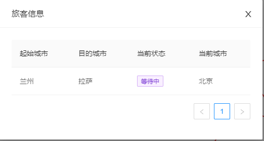

# COVID-19疫情环境下低风险旅行模拟系统

## 问题描述

城市之间有各种交通工具（汽车、火车和飞机）相连，有些城市之间无法直达，需要途径中转城市。某旅客于某一时刻向系统提出旅行要求。考虑在当前COVID-19疫情环境下，各个城市的风险程度不一样，分为低风险、中风险和高风险三种。系统根据风险评估，为该旅客设计一条符合旅行策略的旅行线路并输出；系统能查询当前时刻旅客所处的地点和状态（停留城市/所在交通工具），具体旅行策略见后。

## 功能需求

* 城市总数不少于10个，为不同城市设置不同的单位时间风险值：低风险城市为0.2；中风险城市为0.5；高风险城市为0.9。各种不同的风险城市分布要比较均匀，个数均不得小于3个。旅客在某城市停留风险计算公式为旅客在某城市停留的风险 = 该城市单位时间风险值 * 停留时间。
* 建立汽车、火车和飞机的时刻表（航班表），假设各种交通工具均为起点到终点的直达，中途无经停。
  * 不能太简单，城市之间不能总只是1班车次；
  * 整个系统中航班数不得超过10个，火车不得超过30列次；汽车班次无限制；
* 旅客的要求包括：起点、终点和选择的低风险旅行策略。其中，低风险旅行策略包括：
  * 最少风险策略：无时间限制，风险最少即可
  * 限时最少风险策略：在规定的时间内风险最少
* 旅行模拟系统以时间为轴向前推移，每10秒左右向前推进1个小时(非查询状态的请求不计时，即：有鼠标和键盘输入时系统不计时)；
* 不考虑城市内换乘交通工具所需时间
* 系统时间精确到小时
* 建立日志文件，对旅客状态变化和键入等信息进行记录
* 用图形绘制地图，并在地图上实时反映出旅客的旅行过程。
* 为不同交通工具设置不同单位时间风险值，交通工具单位时间风险值分别为：汽车=2；火车=5；飞机=9。旅客乘坐某班次交通工具的风险 = 该交通工具单位时间风险值*该班次起点城市的单位风险值*乘坐时间。将乘坐交通工具的风险考虑进来，实现前述最少风险策略和限时风险最少策略。

## 总体方案设计说明

软件使用`Windows`的`WSL`系统开发，大体上分为使用`typescript`开发的前端界面，使用`rust`开发的后端逻辑算法两部分

### 软件开发环境

### 总体结构

#### 前端

前端负责应用界面的开发，用于向用户展示架构

前端使用`typescript`作为开发语言，`angular`作为开发框架，`electron`作为桌面化程序开发

* 编译步骤：
  1. 安装`nodejs`、`yarn`
  2. 在前端目录下执行 `yarn`，安装依赖
  3. 执行`yarn electron:windows` 编译windows程序
  4. 执行`yarn electron:linux`编译linux程序
  5. 执行`yarn electron:mac` 编译mac程序（注：只能在macos下进行）

#### 后端

后端负责算法的开发，用于高效快速的执行算法

后端使用`rust`作为开发语言，使用`wasm`作为前后端的衔接层，将`rust`编译为`wasm`供前端调用

* 编译步骤：
  1. 安装`cargo`、`rust`、`wasm-pack`
  2. 进入到后端目录
  3. 执行`wasm-pack build`构建`wasm`
  4. 进入到pkg目录
  5. 执行`yarn link`链接项目
  6. 在前端目录执行`yarn link zekin_data_structure`链接到前端项目
  7. （注：前端项目默认使用已构建好的后端，编译前端不需要先编译后端

### 模块划分

1. 前端模块：负责展示整个应用并接受用户的指令，调用后端的模块，以时间轴向前推进
2. 后端模块：存储了城市和线路的信息，并进行旅行线路的设计
3. 日志文件模块：完成与用户环境进行交互，并对日志文件输出的功能

## 数据结构说明和数据字典

详见https://docs.rs/zekin_data_structure/1.0.0/zekin_data_structure/

## 各模块设计说明

#### 前端模块

* 负责展示整个应用并接受用户的指令
* 负责调用后端模块以及日志文件模块

#### 后端模块

* 负责整个模块的算法和数据存储
* 使用A算法，算法结合了Dijkstra算法和Best First算法，可以快速的找到一个可行解（可能不是最优解），解决了Dij算法可能造成的性能问题，算法细节如下：
  1. 先判断可达性，如果不可达，则无解
     
  2. 初始化open_set和closed_set
  
  3. 将起点加入open_set中
  
  4. 如果open_set不为空，则从open_set中选取优先级最高路径
  
       * 如果路径终点为旅客的终点，则返回此路径，算法结束
  
       * 如果路径超过了时间限制（如果有），则跳过
  
       * 如果路径在closed_set中，则跳过
  
       * 如果都不是
  
           1. 将此路径加入到closed_set中
  
           2. 遍历路径终点的所有可达城市，并将其加入到open_set中
       
   5. 如果open_set为空，则为无解

#### 日志文件模块

* 用于与外界沟通，因为electron的前端是与外界隔离且无法访问文件系统的，所以，就需要此模块来与外界进行沟通，来进行文件的读写操作

* 用于记录、输出日志，供前端调用

## 范例执行结果及测试情况说明

* 使用rust自带的测试工具对代码进行测试，全部通过

  

* 使用wasm-binding对前后端连接部分进行测试，全部通过

  

## 评价和改进意见

由于开发时间的关系，软件还存在着许多问题，希望在以后的时间里可以逐条改正

1. 内存占用需要改进
2. 算法争取能找到最优解
3. 降低打包大小

## 用户使用说明

### 1. 程序主界面

### 2. 点击修改城市信息，进入城市信息界面

修改了城市信息后，点击确定按钮，系统会自动保存，并回到主界面。

**注意！！！，因为修改了路程信息，所以所有旅客和时间信息都会被重置**

### 3. 点击修改交通工具信息，进入到修改交通工具界面

* 点击Edit修改数据
* 点击Delete删除数据
* 点击Add New删除数据

#### 在编辑中，起始城市和目的城市不能相同

#### 火车数量不能超过30辆

#### 飞机班数不能超过10班

编辑完成后，点击确定按钮，系统会自动保存，并回到主界面。

**注意！！！，因为修改了路程信息，所以所有旅客和时间信息都会被重置**

### 4. 点击右下角的添加旅客，进行旅客添加

#### 在编辑中，起始城市和目的城市不能相同

编辑完成后，点击确定按钮，添加旅客

上方出现添加成功，则表明找到了可行方案

出现没有找到可行的方案，则表明没有可行解

添加成功后，主界面将绘制出用户将要行走的界面，当前未到达乘客+1

### 5. 点击右下角的开始按钮，程序开始运行，每8s代表一个小时

在程序运行过程中，用户将会在路径上运动

### 6. 点击上方旅客信息，可以查询到旅客信息

### 7. 点击打开日志文件，将会打开记录的日志文件

### 8. 点击关闭按钮，将会关闭系统

